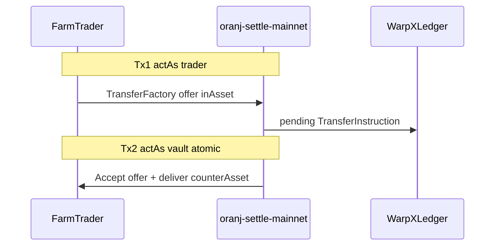
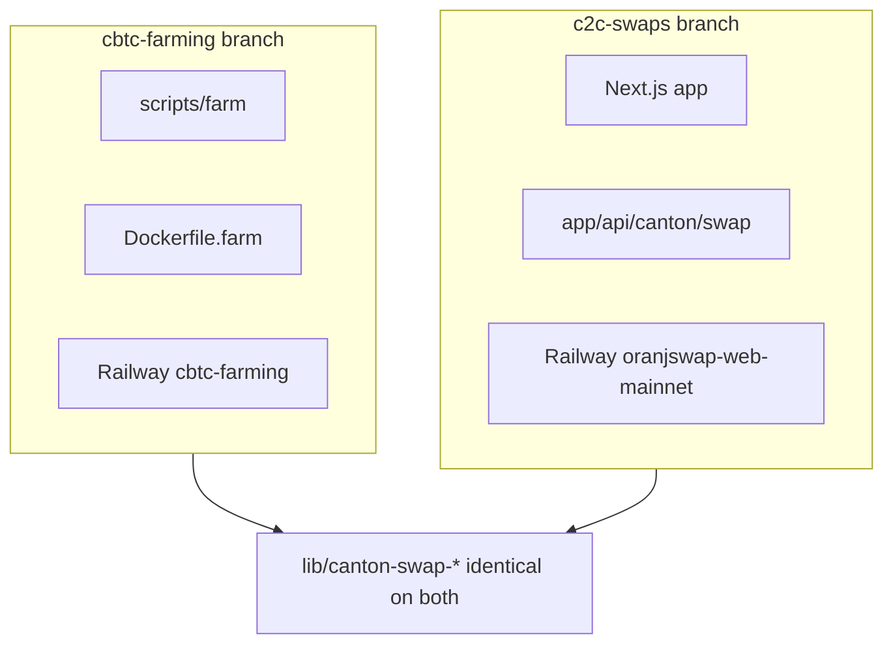

# CBTC Farm — Operations Handbook

**Single source of truth** for the mainnet CBTC farming bot. Read this before changing farm code, Railway deploy, or fleet parties.

Shorter runbook: [`CBTC-FARMING.md`](CBTC-FARMING.md). Railway deploy: [`FARM-RAILWAY.md`](FARM-RAILWAY.md).

---

## 1. Purpose and scope

| In scope | Out of scope |
|----------|--------------|
| Real CC↔CBTC swap volume on Canton mainnet (BitSafe reward share) | Web app / Next.js UI |
| Standalone CLI + Railway worker | Supabase `canton_swap_orders` |
| M2M JWT (WarpX validator) | Loop wallet user flows |
| 5 farm traders + settlement vault | HTLC / EVM swaps |

**BitSafe gate:** written confirmation that bot-driven swap volume counts toward shared reward. Then set `BITSAFE_FARMING_ELIGIBLE=1` or pass `--bitsafe-eligible-confirmed` for continuous runs.

**Branch:** `cbtc-farming` (farm code + identical C2C libs). **Do not** deploy farm from `c2c-swaps` unless farm scripts were merged there intentionally.

**Production status (2026-06-16):** Railway service `cbtc-farming` live; ~38+ successful swaps in first run; occasional traffic rejections (expected).

---

## 2. Architecture

### 2-tx managed swap (same as production C2C offer path)



1. **Tx1** — `actAs: [trader]` → user-leg **offer** to settlement vault  
2. **Tx2** — `actAs: [vault]` → **accept offer + deliver counter** (single submit)

Settlement vault must stay **preapproval-free**. Farm traders need **CC + CBTC preapproval ON**.

### Entry points

| File | Role |
|------|------|
| [`scripts/farm/cli.mts`](../scripts/farm/cli.mts) | CLI: `audit`, `provision`, `quote`, `swap`, `run`, `status`, `audit-burns` |
| [`scripts/farm/railway-start.mts`](../scripts/farm/railway-start.mts) | Railway continuous bot |
| [`scripts/farm/run.ts`](../scripts/farm/run.ts) | Main loop: planner, pacing, retry, logging |
| [`Dockerfile.farm`](../Dockerfile.farm) | Standalone worker image (no Next.js build) |

### File map (`scripts/farm/`)

| Path | Purpose |
|------|---------|
| `lib/settle.ts` | 2-tx managed settle (script-safe copy of web flow) |
| `lib/ledger.ts` | JWT-capable ledger helpers (duplicate of `lib/transfer.ts` — no `server-only`) |
| `lib/execute-swap.ts` | Float check → settle → burn audit |
| `lib/planner.ts` | Balance-aware direction + trader pick |
| `lib/organic.ts` | Sleep / jitter / pacing from args |
| `lib/quote.ts` | Tradecraft RFQ + platform fee |
| `lib/float.ts` | Trader/vault balance + UTXO checks |
| `lib/config.ts` | Fleet JSON, env, mainnet guards |
| `lib/jwt.ts` | Keycloak m2m for scripts |
| `lib/lighthouse.ts` | Traffic bucket read + bytes calibration |
| `lib/retry.ts` | Transient error retry |
| `lib/log.ts` | JSONL `farm-swap.log` |
| `lib/burn-audit.ts` | CC burn choice scan on update trees |
| `lib/mainnet-audit.ts` | Startup env validation |
| `provision.ts` | Allocate traders, preapproval, fund from treasury |
| `status.ts` | Fleet balance summary |
| `audit-burns.ts` | Retro-audit log file |

### State files (gitignored)

| File | Location |
|------|----------|
| `.farm-fleet.mainnet.json` | Local cwd or `FARM_DATA_DIR` (Railway: `/data`) |
| `farm-swap.log` | Same directory |

Fleet JSON shape:

```json
{
  "network": "mainnet",
  "vault": "oranj-settle-mainnet::1220…",
  "treasury": "warpx-mainnet-1::1220…",
  "traders": [{ "hint": "oranj-user-…", "party": "…" }],
  "calibration": { "bytesPerSwap": 24500, "measuredAt": "…", "source": "ledger-estimate" }
}
```

---

## 3. Parties (production mainnet)

All parties share participant suffix:  
`1220517bfd86ef5732610705a35b7b2d56e36112550d6a2b778971dbd099a3d36e99`

### Core roles

| Role | Hint | Full party ID |
|------|------|---------------|
| **Settlement vault** | `oranj-settle-mainnet` | `oranj-settle-mainnet::1220517bfd86ef5732610705a35b7b2d56e36112550d6a2b778971dbd099a3d36e99` |
| **Treasury / validator** | `warpx-mainnet-1` | `warpx-mainnet-1::1220517bfd86ef5732610705a35b7b2d56e36112550d6a2b778971dbd099a3d36e99` |

Env mapping:

- `CANTON_SWAP_SETTLEMENT_PARTY` → vault  
- `SOLVER_CANTON_PARTY` / `NEXT_PUBLIC_SOLVER_CANTON` → treasury  

### Farm traders (5)

| # | Hint | Full party ID |
|---|------|---------------|
| 1 | `oranj-user-777f5c935aa3` | `oranj-user-777f5c935aa3::1220517bfd86ef5732610705a35b7b2d56e36112550d6a2b778971dbd099a3d36e99` |
| 2 | `oranj-user-471ebe32cd1a` | `oranj-user-471ebe32cd1a::1220517bfd86ef5732610705a35b7b2d56e36112550d6a2b778971dbd099a3d36e99` |
| 3 | `oranj-user-60335b6d4b6c` | `oranj-user-60335b6d4b6c::1220517bfd86ef5732610705a35b7b2d56e36112550d6a2b778971dbd099a3d36e99` |
| 4 | `oranj-user-076ed16fe6b7` | `oranj-user-076ed16fe6b7::1220517bfd86ef5732610705a35b7b2d56e36112550d6a2b778971dbd099a3d36e99` |
| 5 | `oranj-user-d73a35a00810` | `oranj-user-d73a35a00810::1220517bfd86ef5732610705a35b7b2d56e36112550d6a2b778971dbd099a3d36e99` |

### Preapproval matrix

| Party | CC preapproval | CBTC preapproval |
|-------|----------------|------------------|
| `oranj-settle-mainnet` | **OFF** | **OFF** |
| `warpx-mainnet-1` | ON | ON |
| Each `oranj-user-*` | ON | ON |

**Never** set `CANTON_SWAP_SETTLEMENT_PARTY` to `warpx-mainnet-1` — breaks offer-path atomic swaps; does not increase validator rewards meaningfully.

### On-ledger infrastructure (not farm-owned)

| Party | Role |
|-------|------|
| `cbtc-network::12205af3b949a04776fc48cdcc05a060f6bda2e470632935f375d1049a8546a3b262` | CBTC Token Standard registrar |
| DSO / Amulet admin (from CC scan at runtime) | CC registrar |

---

## 4. Configuration

### Local

Load via [`scripts/with-env.sh`](../scripts/with-env.sh) + `.env.mainnet` + `.env.local`:

```bash
npm run farm:status:mainnet
```

Required env (see [`scripts/farm/lib/mainnet-audit.ts`](../scripts/farm/lib/mainnet-audit.ts)):

- `NEXT_PUBLIC_NETWORK=mainnet`
- `KEYCLOAK_TOKEN_URL`, `KEYCLOAK_CLIENT_ID`, `KEYCLOAK_CLIENT_SECRET`, `KEYCLOAK_SCOPE`
- `CANTON_SWAP_SETTLEMENT_PARTY`
- `SOLVER_CANTON_PARTY` or `NEXT_PUBLIC_SOLVER_CANTON`

Optional:

- `CC_REGISTRY_URL` — defaults to `https://scan.sv-1.global.canton.network.sync.global` (warning only if unset)
- `PLATFORM_FEE_BPS`, `TRADECRAFT_API_URL`
- `BITSAFE_FARMING_ELIGIBLE=1`
- `FARM_MAINNET_CONFIRMED=1` (or `--i-understand-mainnet`)

### Railway (13 variables)

| Variable | Value |
|----------|--------|
| `NEXT_PUBLIC_NETWORK` | `mainnet` |
| `BITSAFE_FARMING_ELIGIBLE` | `1` |
| `FARM_MAINNET_CONFIRMED` | `1` |
| `FARM_MAX_SWAPS` | `0` |
| `FARM_DATA_DIR` | `/data` |
| `KEYCLOAK_TOKEN_URL` | WarpX mainnet |
| `KEYCLOAK_SCOPE` | `daml_ledger_api` |
| `KEYCLOAK_CLIENT_ID` | `validator-mainnet-m2m` |
| `KEYCLOAK_CLIENT_SECRET` | *(secret)* |
| `CANTON_SWAP_SETTLEMENT_PARTY` | vault party |
| `SOLVER_CANTON_PARTY` | treasury party |
| `NEXT_PUBLIC_SOLVER_CANTON` | same as treasury |
| `FARM_FLEET_JSON_B64` | base64 of `.farm-fleet.mainnet.json` |

**Not needed:** Supabase, EVM keys, `CRON_SECRET`, Loop wallet vars.

Export fleet for Railway:

```bash
base64 < .farm-fleet.mainnet.json | tr -d '\n' | pbcopy
```

### npm scripts (on `cbtc-farming` branch)

| Script | Purpose |
|--------|---------|
| `farm:audit:mainnet` | Validate env |
| `farm:provision:mainnet` | One-time fleet setup |
| `farm:quote:mainnet` | Tradecraft quote |
| `farm:swap:mainnet` | Single swap |
| `farm:run:mainnet` | Continuous bot |
| `farm:status:mainnet` | Balances + UTXO |
| `farm:audit-burns:mainnet` | Retro CC burn scan |
| `farm:run:railway` | Railway entry (env-only) |
| `fund-swap-vault:mainnet` | Fund vault from treasury |
| `party-balances:mainnet` | Single-party balances |

---

## 5. Operations

### One-time setup

```bash
npm run farm:provision:mainnet -- --i-understand-mainnet
npm run fund-swap-vault:mainnet -- --i-understand-mainnet
npm run farm:status:mainnet
```

Default provision: **5 traders**, **120 CC + 0.0003 CBTC** each from treasury. Vault funded separately.

### Smoke test

```bash
# CBTC → CC
npm run farm:swap:mainnet -- --i-understand-mainnet --trader=0 --from=CBTC --to=CC --in=0.0001

# CC → CBTC
npm run farm:swap:mainnet -- --i-understand-mainnet --trader=1 --from=CC --to=CBTC --in=50
```

### Continuous run

**Local (tmux):**

```bash
npm run farm:run:mainnet -- \
  --i-understand-mainnet \
  --bitsafe-eligible-confirmed \
  --max-swaps=0
```

**Railway:** service `cbtc-farming`, branch `cbtc-farming`, `Dockerfile.farm`, volume at `/data`.

### Swap amounts (production defaults)

| Direction | Input |
|-----------|--------|
| CBTC→CC | `0.0001` CBTC |
| CC→CBTC | `50` CC |

Override: `--cbtc-in`, `--cc-in`.

---

## 6. Pacing and planner

### Traffic pacing

| Parameter | Default |
|-----------|---------|
| Refill rate | ~333 B/s free bucket |
| Bytes per swap | **24,500** (2 txs; ledger-measured) |
| Target utilization | 92% (`--target-utilization=0.92`) |
| Mean interval | ~**80 s** |
| Min sleep after swap | 20 s (minus swap duration) |
| Max backoff interval | 900 s (15 min) |

```
mean_interval_s = bytes_per_swap / (333 × target_utilization)
sleep = max(20s, mean_interval - swap_duration)
```

Lighthouse `total_consumed` often reports **0** on warpx — bot uses fleet calibration / ledger estimate.

### Planner rules

1. Load trader + vault balances  
2. Quote both directions  
3. **Alternate direction** (no two same-direction swaps in a row)  
4. Same trader cannot repeat same direction back-to-back  
5. Rebalance score toward ~120 CC / ~0.0003 CBTC per trader  
6. Reserves: +0.00005 CBTC / +10 CC above swap size  
7. Skip if UTXO ≥ 10 (warn at 8)

### Expected throughput

~**170–190 swaps/day** at default pacing (~75–90 s between completions).

---

## 7. Monitoring

| Signal | How |
|--------|-----|
| Live swaps | Railway logs: `✓ swap N:` |
| Audit log | `/data/farm-swap.log` or local `farm-swap.log` |
| Balances | `npm run farm:status:mainnet` |
| CC burns | `npm run farm:audit-burns:mainnet` |
| Traffic | [Lighthouse warpx-mainnet-1](https://lighthouse.cantonloop.com/api/validators/warpx-mainnet-1%3A%3A1220517bfd86ef5732610705a35b7b2d56e36112550d6a2b778971dbd099a3d36e99) |

Log fields per swap: `swapDurationSec`, `sleepAfterSec`, `wallIntervalSec`, `ccBurnSuspected`.  
Every 5 swaps: `run_summary` JSON line.

---

## 8. Production error playbook

| Error | Severity | Action |
|-------|----------|--------|
| `traffic rejection` / `SEQUENCER_REQUEST_FAILED` | Normal | Bot doubles backoff (80→160→320→640→900s cap); continues |
| `503` ledger slow | Transient | Auto-retry (up to 4×); usually succeeds |
| `Given holdings are invalid` (TransferFactory 400) | Transient | Stale holdings after 503/traffic; bot skips swap and continues. **Future fix:** re-fetch holdings before factory call; filter locked CC holdings |
| `trader insufficient` / `vault insufficient` | Action needed | `npm run fund-swap-vault:mainnet` or top up traders from treasury |
| `UTXO at cap` | Action needed | Pause trader; merge holdings |
| `⚠ CC burn/fee choice` | Investigate | Run `farm:audit-burns:mainnet` |
| `CC_REGISTRY_URL unset` warning | Ignore | Uses correct mainnet default |

### Railway / Docker failures (resolved 2026-06-16)

| Symptom | Fix |
|---------|-----|
| `next build` in deploy logs | Set **Dockerfile path** = `Dockerfile.farm`, not Nixpacks |
| `npm ci` / picomatch EUSAGE | Dockerfile uses `npm install` + copies `.npmrc`; regenerate lock with npm 10 if needed |
| `Class extends value undefined` on start | Use `./node_modules/.bin/tsx` in CMD; **do not** use `npx` with `NODE_ENV=production` |
| Empty start command override | Clear custom start command in Railway settings |

See [`FARM-RAILWAY.md`](FARM-RAILWAY.md) for full deploy steps.

---

## 9. CC economics vs BitSafe rewards

**BitSafe farming share** = on-ledger **CBTC swap volume** (why we run the bot).

**Validator CC rewards** (separate): mainly from **CC burns** (preapproval setup, traffic top-ups), not from moving CBTC/CC between parties. Farm swaps consume **traffic bytes**; occasional traffic rejection is the limiter.

Do not merge settlement into `warpx-mainnet-1` for “rewards.”

Details: [`CBTC-FARMING.md` § CC economics](CBTC-FARMING.md).

---

## 10. Relationship to web C2C (`c2c-swaps` branch)

| Component | Farm | Web |
|-----------|------|-----|
| Settle core | [`scripts/farm/lib/settle.ts`](../scripts/farm/lib/settle.ts) (~158 lines) | [`lib/canton-swap-settle.ts`](../lib/canton-swap-settle.ts) (recovery, Loop, reconcile) |
| Ledger | [`scripts/farm/lib/ledger.ts`](../scripts/farm/lib/ledger.ts) (jwt param) | [`lib/transfer.ts`](../lib/transfer.ts) (`server-only`) |
| Orders | Fleet JSON only | Supabase + [`lib/canton-swap-service.ts`](../lib/canton-swap-service.ts) |
| API | None | [`app/api/canton/swap/`](../app/api/canton/swap/) |
| Deploy | Railway `cbtc-farming` | Railway `oranjswap-web-mainnet` |

**Same parties, same vault, same 2-tx offer path.** Farm validates mainnet settle works; web adds user auth, Loop, DB, daemons.

Web launch checklist: [`C2C-MAINNET-LAUNCH.md`](C2C-MAINNET-LAUNCH.md).

### Future refactors (optional, separate PR)

- Extract jwt-capable ledger core; delete farm `ledger.ts` duplicate  
- Re-fetch holdings on `Given holdings are invalid`  
- `FARM_TARGET_UTILIZATION` env var for Railway tuning  
- Filter locked CC Amulets in `listCcHoldings`

---

## 11. Branch and deploy isolation



- **Keep farm running** on `cbtc-farming` — do not stop when switching local work to `c2c-swaps`.  
- **Do not** deploy farm scripts from the web service.  
- Docs in this handbook apply to farm ops regardless of which branch you have checked out locally.

---

## 12. Implementation checklist

- [x] Mainnet config audit passes  
- [x] BitSafe eligibility confirmed  
- [x] Fleet provisioned (5 traders) + vault funded  
- [x] Smoke swaps both directions  
- [x] Continuous run validated (local + Railway)  
- [x] Railway deploy (`Dockerfile.farm`, volume `/data`, 13 env vars)  
- [ ] Holding-refresh hardening after TransferFactory 400  
- [ ] `FARM_TARGET_UTILIZATION` env knob  
- [ ] Lighthouse calibration when `total_consumed` > 0  
